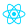

<!-- Banner -->

  

<!-- Role pills — trailing spacer equalizes row so Systems Builder sits at row center -->

  
  
  
  

<!-- Status pill -->

  

<!-- Typing headline -->

  

<!-- Socials + profile views -->

  

  

<!-- Animated section heading: About -->

  

- Build full-stack web applications using the MERN stack and RESTful API architecture.
- Engineer IoT systems with ESP32, MQTT, and Arduino Cloud for real-time automation.
- Strong foundation in Data Structures, Algorithms, OOP, DBMS, and Operating Systems.
- 3rd year CSE student at NIE Mysore, graduating 2026 | CGPA: 8.0/10.
- Open to Software Engineering, Full-Stack Development, and Product Engineering opportunities.
- LeetCode -> **[Rayyanr6](https://leetcode.com/u/Rayyanr6/)**
- LinkedIn -> **[Mohammad Rayyan Jameel](https://www.linkedin.com/in/rayyan-jameel-521b06341)**

  

<!-- Animated section heading: Tech -->

  

  
  
  
  
  
  
  
  

  
  
  
  
  
  
  
  

  
  
  
  
  
  
  
  

<!-- Branded icons fetched from each tool's official site -->

  
  &nbsp;
  
  &nbsp;
  
  &nbsp;
  

  
  &nbsp;
  
  &nbsp;
  
  &nbsp;
  
  &nbsp;
  
  &nbsp;
  

<!-- DevOps / hosting extras -->

  
  &nbsp;
  
  &nbsp;
  

  

<!-- Animated section heading: GitHub stats -->

  

  
<!--
  
-->

  

<!-- Animated section heading: Activity -->

  

  

  

<!--
  Trophies section — disabled because github-profile-trophy.vercel.app is
  currently returning 503 (DEPLOYMENT_PAUSED). Uncomment to re-enable once
  the upstream service is back.

  

    
  

  

    
  

-->

  

